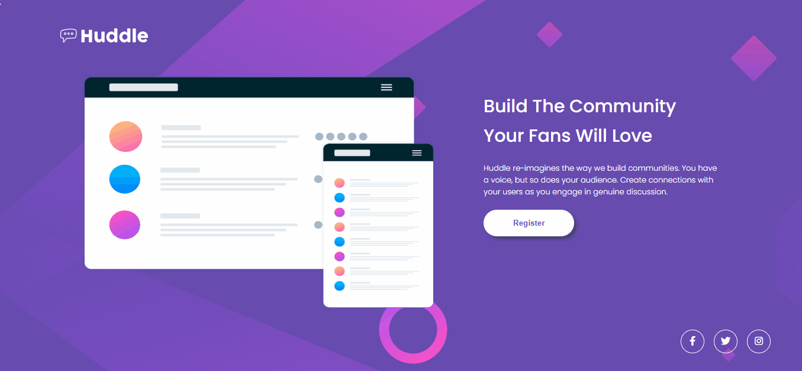

# Quest HTML + CSS Avançado - Huddle
Projeto do curso DEV Quest do DEV em Dobro, onde é criada uma página do Huddle. O Huddle é uma plataforma de comunidades que promove conecções entre o provedor e seus usuários/clientes, através de discussões genuínas.

## Tecnologias utilizadas
- HTML
- CSS

### Imagem do Projeto

### Responsivo do Projeto

Obrigada pela visita!